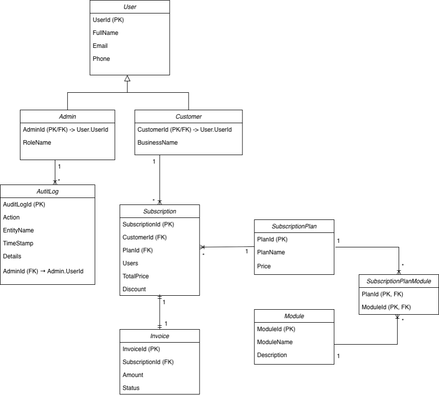
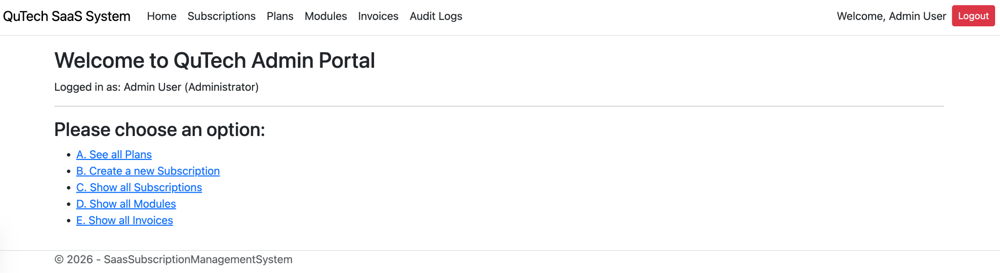
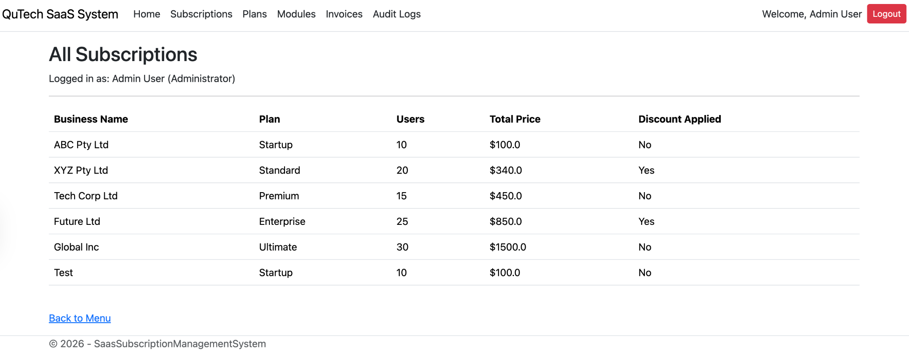
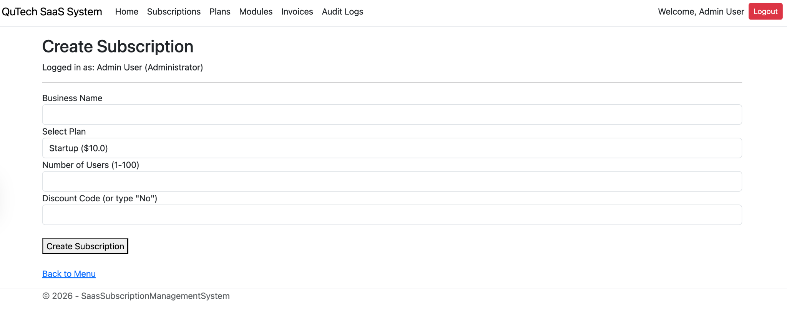
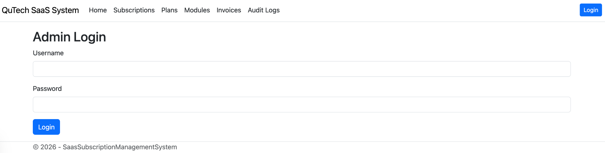

# SaaS Subscription Management System

## Overview

This project is a web-based administrative system for managing SaaS subscription services.  
It allows administrators to manage subscription plans, customers, subscriptions, modules, invoices, and audit logs.

The application is built using ASP.NET Core MVC and demonstrates a typical enterprise-style web application with structured architecture and database integration.

---

## Features

- Administrator login and authentication
- Manage subscription plans
- Create and manage customer subscriptions
- Assign modules to subscription plans
- View and manage invoices
- Audit log tracking for administrative actions
- Input validation using Data Annotations
- Seed data for initial setup

---

## Technologies Used

- C#
- ASP.NET Core MVC
- Entity Framework Core
- SQLite
- HTML / CSS
- Bootstrap
- Git / GitHub

---

## Architecture

This system follows the **MVC (Model-View-Controller)** architecture:

- **Model**: Handles data and business logic (User, Customer, Subscription, Invoice, etc.)
- **View**: Displays UI using Razor pages
- **Controller**: Handles user requests and application logic

This separation improves maintainability and scalability.

---

## ER Diagram

The following diagram shows the database structure and relationships between entities:



---

## Key Design

- One-to-many relationship: Customer → Subscription  
- One-to-one relationship: Subscription → Invoice  
- Many-to-many relationship: SubscriptionPlan ↔ Module  
- Audit logging for tracking admin actions  

---

## How to Run

1. Clone the repository

```bash
git clone https://github.com/nkysd/saas-subscription-management-system.git
```

2. Move into the project folder

```bash
cd SaasSubscriptionManagementSystem
```

3. Restore packages

```bash
dotnet restore
```

4. Apply database migration

```bash
dotnet ef database update
```

5. Run the application

```bash
dotnet run
```

---

## Default Login

Use the following seeded administrator account to access the system:

Username:
```
admin
```

Password:
```
Admin123!
```

---

## Screenshots

### Admin Dashboard


### Subscription Management


### Create Subscription


### Admin Login Page


---

## Project Purpose

This project was originally developed as a university lab assessment and has been refined as a portfolio project to demonstrate:

- Web application development using ASP.NET Core MVC
- Database design and relationships
- CRUD operations
- Form validation
- Authentication and authorization

---

## Future Improvements

- Role-based authorization
- REST API integration
- Improved UI/UX design
- Cloud deployment (AWS / Azure)
